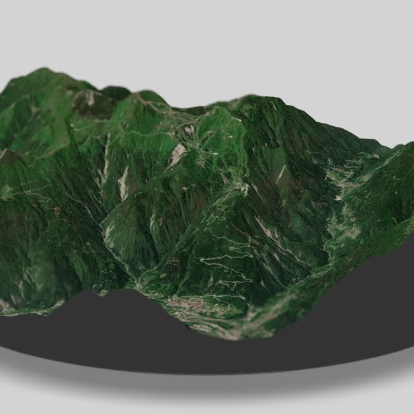

# Using Rayvista and Rayshader

The .rmd file located in this repo has code to allow you to very easily make a 3D elevation plot with a satellite imagine overlay using the [{rayvista}](https://github.com/h-a-graham/rayvista) package.

Here's one I made of Monte Zoncolan in Italy.

